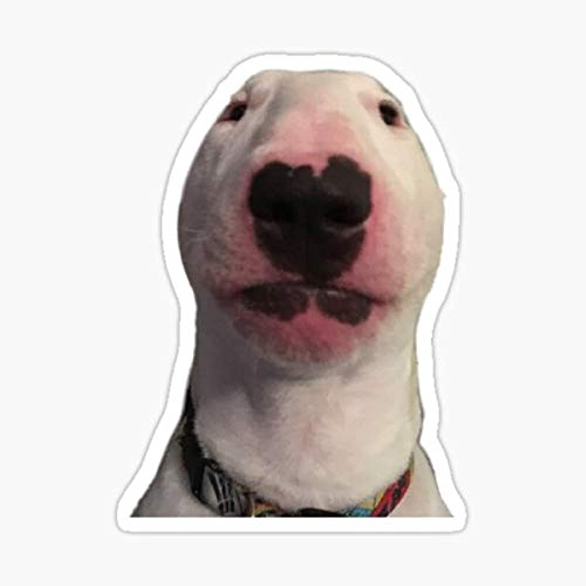

# 一隻貓貓的故事

<!--  -->

很久很久以前，在一個狗狗王國裡，有一隻叫做巴豆的狗狗。巴豆是一隻非常調皮搗蛋的小狗，經常把整個王國弄得一團糟。

有一天，巴豆又來了一個瘋狂的點子。它決定去當個時髦的「無耳派」，於是巴豆拿起剪刀，把自己的耳朵給剪了一半。

當巴豆出現在王國裡時，所有的狗狗都傻眼了。他們紛紛圍觀著巴豆，笑得肚子都疼了。巴豆卻搖搖尾巴，得意地說道：「看看我，這麼時髦的無耳派，不是很酷嗎？」

其他狗狗們都笑得前仰後合，紛紛對巴豆稱讚他的「獨特風格」。就這樣，巴豆成了王國裡的名人，許多狗狗紛紛效仿他的模樣，紛紛剪下了自己的耳朵。

然而，有一天，一個遠道而來的貓咪來到了王國。它看到所有的狗狗都剪掉了耳朵，不禁捂著嘴巴笑得合不攏嘴。貓咪走到巴豆面前，說道：「嘿，巴豆，你的耳朵呢？」

巴豆尷尬地笑了笑，坦承了自己的愚蠢行為。他意識到自己只是一時追求潮流，卻沒有想過後果。巴豆決定向大家道歉，並帶領王國裡的狗狗們重新種植耳朵。

從那以後，王國裡的狗狗們學到了一個重要的教訓：不要盲目追隨時尚，重要的是保持自己的獨特與真實。而巴豆也成了王國裡最有趣的狗狗，大家總是開玩笑地說，他是唯一一隻有「半耳朵」的狗狗，而這成了大家開心的話題。

